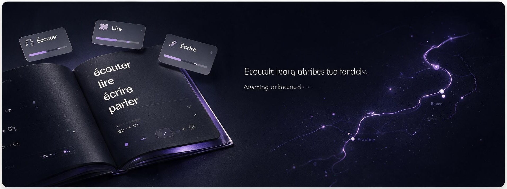

# TCF Journey

<div align="center">

**A personal study journal for preparing for the TCF Canada exam (C1 level)**

[](https://jekyllrb.com)
[](LICENSE)
[](https://github.com)

</div>

---

## 📚 What's Inside

Track your TCF preparation journey with:

- 🎯 **Drill progress** — organized by tâche (CO, CE, EO, EE) with completion tracking
- 🃏 **Flip cards** — French vocabulary and grammar with instant reveal
- 📝 **Study journal** — reflections on what works, mock-exam post-mortems, routines
- 📊 **Live stats** — days to exam, drills done, total study hours at a glance

## ✨ Features

### Interactive
- 🌙 **Dark/light theme** toggle with persistent preference
- 📍 **Cursor spotlight** effect that follows your mouse
- 🧩 **3D rotating cube** showing progress per section (draggable)
- 🎴 **Flip cards** with drag-to-throw physics and momentum
- ↻ **Reset button** to restore thrown cards to original positions

### Intelligent
- 💾 **Progress persistence** — all drills marked done are saved in browser localStorage
- 📱 **Responsive design** — works on mobile, tablet, desktop
- 🔍 **Drill filters** — search and filter by section, level, tâche, or topic
- ⏱️ **Reading time estimates** — auto-calculated for posts and drills

### Deployment
- 🚀 **GitHub Pages hosting** — free, automatic deployment on push to main
- 🔄 **GitHub Actions CI/CD** — builds site on every commit

## 🛠️ Tech Stack

| Layer | Tech | Why |
|-------|------|-----|
| **Generator** | [Jekyll 4.4](https://jekyllrb.com) | Fast, static, great for blogging |
| **Styling** | [SCSS](https://sass-lang.com) + CSS custom properties | Modular, themeable, performant |
| **Interactivity** | Vanilla JavaScript | No framework bloat, direct DOM control |
| **Hosting** | GitHub Pages + Actions | Free, reliable, auto-deploy on push |
| **Fonts** | [Bricolage Grotesque](https://fonts.google.com/specimen/Bricolage+Grotesque) + [Patrick Hand](https://fonts.google.com/specimen/Patrick+Hand) | Bold headings, natural handwriting feel |

## 🚀 Getting Started

### Prerequisites

- Ruby 3.1+
- Docker & Docker Compose (for consistent environment)
- Git

### Quick Start

```bash
# Clone the repo
git clone https://github.com/yourusername/tcf-journey.git
cd tcf-journey

# Install gems
bundle install

# Start dev server (auto-rebuilds on file changes)
docker-compose up
```

Visit **http://localhost:4000/tcf-journey/** in your browser.

### Project Structure

```
tcf-journey/
├── _config.yml              # Site config & collection definitions
├── _includes/
│   └── sections/            # Reusable page sections
├── _layouts/
│   ├── default.html         # Base layout with header/footer
│   ├── drill.html           # Single drill page template
│   └── post.html            # Blog post template
├── _sass/
│   ├── base.scss            # Global styles, primitives, theme
│   ├── variables.scss       # Design tokens, spacing, colors
│   └── pages/               # Page-specific styles
├── _french/                 # Flip card collection (markdown)
├── _tcf/                    # Drill collection (markdown)
├── _posts/                  # Blog posts (markdown)
├── assets/
│   ├── css/main.css         # Compiled stylesheet
│   ├── js/                  # Feature scripts (dark mode, drills, cards)
│   └── images/              # Photos, icons
└── .github/workflows/       # GitHub Actions CI/CD
```

### Key Files to Know

| File | Purpose |
|------|---------|
| `_config.yml` | Collections, site metadata, build settings |
| `_data/about.yml` | Exam date, profile info, statistics |
| `_data/tcf.yml` | TCF section/level definitions |
| `_sass/base.scss` | Design primitives (`.paper`, `.tape`, `.wob`, `.punch`) |
| `assets/js/main.js` | Spotlight, cube, reveal observer |
| `assets/js/french-cards.js` | Flip & drag card interactions |

## 🌐 Deployment

### GitHub Pages Setup (First Time)

1. Go to your repo **Settings** → **Pages**
2. Under "Source", select **GitHub Actions**
3. That's it! The workflow will run on your first push

### Deploy Your Changes

```bash
# Make changes, commit, and push
git add .
git commit -m "Add new drills"
git push origin main
```

GitHub Actions automatically builds and deploys to GitHub Pages. Check the **Actions** tab to see build status.

> 💡 **Tip:** Your site URL will be `https://username.github.io/tcf-journey/` (unless you configure a custom domain)

## 📋 Adding Content

### Add a Drill

Create a new markdown file in `_tcf/`:

```markdown
---
layout: drill
title: Discuss a Photo
section: eo
tache: Monologue
level: B2+
topic: Photography
date: 2024-01-15
brief: >
  Describe what you see in the image. Comment on the composition, lighting, and mood.
---

## Key Vocabulary
- la lumière (lighting)
- la composition (composition)

## Practice Tips
- Speak for 1.5 minutes minimum
- Use varied adjectives
```

### Add a Flip Card

Create a new markdown file in `_french/`:

```markdown
---
layout: card
term: avoir beau
category: expression
gender: locution
level: B1
hint: même si
meaning: "In vain; even if one does something (result is unchanged)"
example: "Ils ont beau crier, personne ne les entend."
example_en: "They may shout all they like, but nobody hears them."
---
```

### Add a Blog Post

Create a new markdown file in `_posts/` named `YYYY-MM-DD-title.md`:

```markdown
---
layout: post
title: First Mock Exam Post-Mortem
date: 2024-01-20
summary: Reflections after scoring 385 on my first full mock.
description: >
  What went well, what didn't, and what I'm changing this week.
---

## What Went Well

- EO section fluency is improving
- Listening comprehension much better...
```

## 🎓 Study Goals & Tracking

| Metric | Goal | Status |
|--------|------|--------|
| **Target Level** | C1 (400+/430) | 🎯 |
| **Exam Date** | [Update in `_data/about.yml`] | 📅 |
| **Drills Completed** | Tracked in localStorage | 📊 |
| **Cards Mastered** | 10+ vocabulary sets | 🃏 |
| **Mock Exams** | 3+ full practice tests | ✅ |

## 🎨 Customization

### Change Colors

Edit `_sass/variables.scss`:

```scss
$color-accent: #your-color;
$color-text: #your-text-color;
$color-bg: #your-bg-color;
```

### Change Fonts

Edit `_includes/header.html` and update the Google Fonts link:

```html
<link href="https://fonts.googleapis.com/css2?family=YourFont:wght@400;700&display=swap" rel="stylesheet">
```

Then update `_sass/variables.scss`:

```scss
$font-heading: 'Your Font', sans-serif;
```

## 📞 Contributing

Found a bug? Have a suggestion?

1. Open an [Issue](https://github.com/yourusername/tcf-journey/issues)
2. Or submit a [Pull Request](https://github.com/yourusername/tcf-journey/pulls)

## 📄 License

MIT License — feel free to fork and adapt for your own exam prep!
